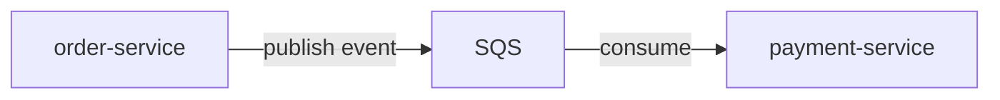

<h1 align="center"> order-processing-api </h1>

<p align="center">
Event-driven microservices for order processing using Spring Boot, AWS SQS and Docker.<br>
Focused on asynchronous communication and distributed systems concepts.
</p>

<p align="center">
    
	
</p>
<p align="center">
    
</p>


<details>
    <summary>📚 <b> Table of Contents </b> </summary>

- [Tech stack](#tech-stack)
- [Architecture](#architecture)
- [Features](#features)
- [AWS Configuration](#aws-configuration)
- [Running locally](#running-locally)
- [Roadmap](#roadmap)
- [Goal](#goal)

</details>


## Tech Stack
- Java 21
- Spring Boot
- AWS SQS
- Docker / Docker Compose
- H2 Database

## Architecture



### Flow

1. Client sends request to order-service
2. Order is created and persisted
3. An OrderCreatedEvent is published to SQS
4. payment-service consumes the event
5. Payment is processed asynchronously

## Features

- Asynchronous communication via AWS SQS
- Microservices architecture (order-service and payment-service)
- Idempotent message processing
- Dockerized services with docker-compose
- End-to-end event flow validated

## AWS Configuration

This project requires AWS credentials to access SQS. 

Make sure you have [AWS CLI](https://docs.aws.amazon.com/pt_br/cli/latest/userguide/getting-started-quickstart.html) installed, then run: 

```bash
aws configure
```

Provide the following information when prompted:

- AWS Access Key ID: `your_access_key`
- AWS Secret Access Key: `your_secret_key`
- Default region name: `sa-east-1`
- Default output format: `json`

> [!NOTE]
> Credentials must be stored under the `default` profile to be automatically detected.


##  Running locally

### Requirements

- Docker (Docker Desktop recommended for Windows/Mac)
- AWS credentials configured [(see AWS Configuration section)](#aws-configuration)

### Start services


```bash
docker compose up --build
```

> [!TIP]
> To run in the background and keep your terminal free, use `docker compose up -d --build`.

After starting, services will be available at:

- order-service → http://localhost:8081
- payment-service → (no public HTTP endpoints)

Orders can be created using curl or an API Client.

### Using curl

```bash
curl -X POST http://localhost:8081/orders \
-H "Content-Type: application/json" \
-d '{"customerName":"John Doe","amount":100}'
```

### Using API Client

- *URL:* `http://localhost:8081/orders`
- *HTTP Method:* `POST`
- *Content-Type:* `application/json`
- *Request body (example):*
```json
	{
	    "customerName": "John Doe",
	    "amount": 100
	}
```

## Roadmap

See [ROADMAP.md](./order-service/ROADMAP.md)

## Goal

Study and implement event-driven architecture concepts using AWS and Spring ecosystem.
