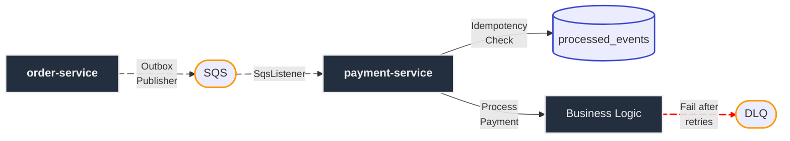

<h1 align="center"> order-processing-api </h1>

<p align="center">
Event-driven microservices for order processing using Spring Boot, AWS SQS and Docker.<br>
Focused on asynchronous communication and distributed systems concepts.
</p>

<p align="center">
    
	
</p>
<p align="center">
    
</p>


<details>
    <summary>📚 <b> Table of Contents </b> </summary>

- [Tech stack](#tech-stack)
- [Architecture](#architecture)
- [Reliability & Patterns](#reliability--patterns)
- [Trade-offs](#trade-offs)
- [Running locally](#running-locally)
- [Testing the flow](#testing-the-flow)
- [Roadmap](#roadmap)
- [Goal](#goal)

</details>


## Tech Stack
- Java 21
- Spring Boot
- AWS SQS
- Docker / Docker Compose
- H2 Database

## Architecture



### Flow

1. **Order Entry:** `order-service` receives a request, persists the order and saves an event in the Outbox table.
2. **Async Dispatch:** The event is published to AWS SQS.
3. **Consumption:** `payment-service` listens to the queue and ensures idempotency via a `processed_events` table.
4. **Resilience:** If payment fails, the consumer retries messages with exponential backoff. After exhaustion, they are moved to the DLQ.

## Reliability & Patterns

- **Transactional Outbox:** Ensures data consistency between database and message broker.
- **Idempotent consumer:** Prevents duplicate processing of the same event.
- **Exponential backoff:** Smart retry strategy to handle transient failures.
- **Dead Letter Queue (DLQ):** Isolation of poisonous message for manual analysis.

## Trade-offs

- **H2 Database:** Used for zero-setup local dev. In production, PostgreSQL/DynamoDB would be preferred.
- **Simulated payment:** The payment gateway is mocked to focus on the architectural flow rather than external APIs.
- **Manual DLQ Recovery:** Reprocessing logic is not implemented yet and requires manual intervention.

## Running locally

### 1. AWS Configuration

This project requires AWS credentials to access SQS. Make sure you have [AWS CLI](https://docs.aws.amazon.com/pt_br/cli/latest/userguide/getting-started-quickstart.html) installed, then run: 

```bash
aws configure
```

> [!NOTE]
> Credentials must be stored under the `default` profile to be automatically detected. Use region `sa-east-1`.

### 2. Start services

```bash
docker compose up --build
```

| Service | Endpoint |
| --- | --- |
| order-service | http://localhost:8081 |
| payment-service | (Internal Consumer) |

> [!TIP]
> Tail the logs to watch the event processing and retries in real-time: `docker logs -f payment-service`


## Testing the flow

Orders can be created using curl or an API Client.

```bash
curl -X POST http://localhost:8081/orders \
-H "Content-Type: application/json" \
-d '{"customerName":"John Doe","amount":100}'
```

> [!WARNING] 
> This project intentionally simulates failures for demonstration purposes. Sending an amount > 100 will trigger 3 retries followed by the message moving to the DLQ.

> [!TIP]
> Try sending different values to check the system behavior.


## Roadmap

See [ROADMAP.md](./ROADMAP.md)

## Goal

Study and implement event-driven architecture concepts using AWS and Spring ecosystem.
